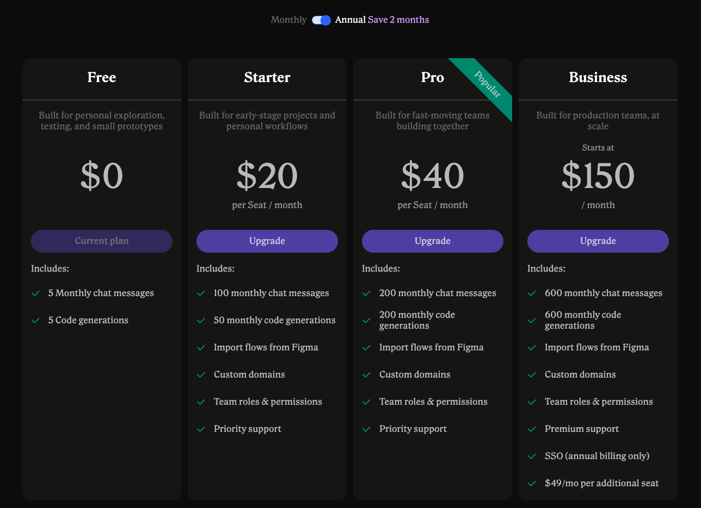

# Figma to HTML/CSS

## Anima

- Link: <https://dev.animaapp.com/>
- Figma Plugin
- Cannot download or copy code without upgrading first.
- Result looks really good.

- Options
  - High fidelity
  - Clean code
  - Framework: HTML/React.
  - Styling: Tailwind, CSS, Inline Styles

- Example (Frame 206 of <https://www.figma.com/design/q0gU92xx1eofVYRkyo9nf4/exported_house_21>)
  - High fidelity (HTML and CSS) (Speed: Fast)
    - Preview: <https://dev.animaapp.com/chat/mkaj8nesXtrONj>
  - Clean code (HTML and Tailwind) (Speed: 10-15 minutes)
    - Preview: <https://dev.animaapp.com/chat/mkakd5zhqx6owz>

## Locofy

- Link: <https://www.locofy.ai/>
- No Free Test.
- They say it has the cleanest code when generating to HTML but cannot verify yet.

## Figma to Code (HTML, Tailwind, Flutter, SwiftUI)

- Figma Plugin
- Example: figma-to-code-plugin.html
- Quality: Not very good

## Builder.io

- Link: <https://builder.io/>
- Best one I found.
- Pricing: <https://builder.io/account/subscription>
- Open the plugin in figma, select the layers we want, copy the command, and run in project.
- Two options
  - Smart Export.
    - There will be prompt that allow us to specify how we want them to export the design. (To HTML/CSS or other frameworks)
    - Example: builder-first-example
  - Classic Export
    - Easy Mode: For simple designs; doesn't require much setup.
    - Precise Mode: Requires perfect Auto Layout. If your Auto Layout is perfect, this gives you pixel-perfect results that match your structure 1:1.
    - Example: builder-second-example
